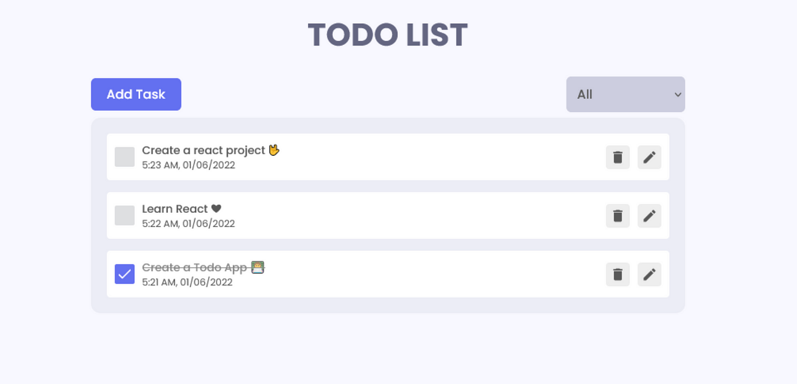

# TickIt-backend

## Summary

Create a backend with Spring that can create, update, read and delete todos from a MySQL database. Along with this create a frontend application with React that interacts with this backend.

## Example UI

## Frontend MVP

- Ability to add, complete, delete and edit todos
- Typescript & testing with React Test Library
- All errors must be handled and passed on properly back to the user (toast notifications are a good way of doing this)
- Must look polished, there is an example image attached to this spec and there are hundreds of examples of good looking todo apps online

## Backend MVP

- All endpoints must be error handled such that they return the correct status codes and messages.
- Implement a logging strategy for requests being processed (there are loads of recourse you can find via google to do this)
  - Log4j
- Use spring swagger to generate documentation for your API

## BONUSES

- There are heaps of additional things you can do here
  - Search
  - Sort
  - Filter
  - Categories
  - Sub tasks
  - Progress bars
  - Authentication
  - Pagination
- But don't start adding this stuff till you have a solid MVP

## Due Date

- There is no specified due date
- It will be up to you to organise a time to share your project with a coach
  - Our expectation is that this will occur in the first week of the post course period
  - If that's not possible you need to organise an alternative time with a coach
